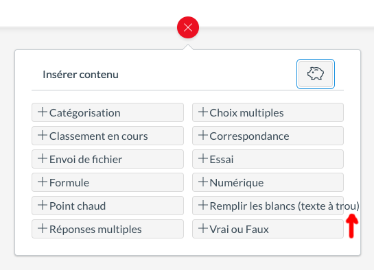
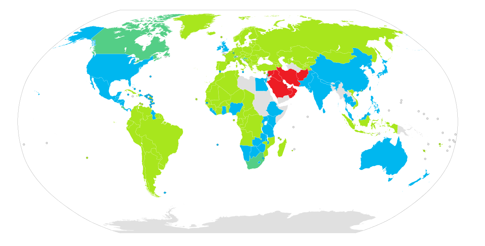
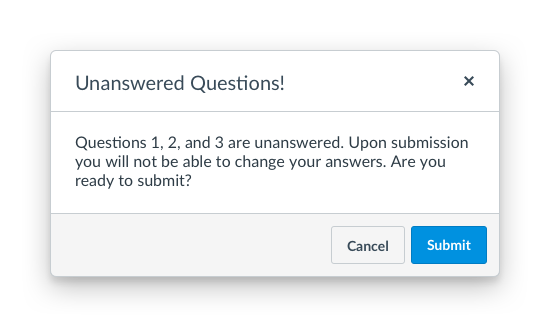
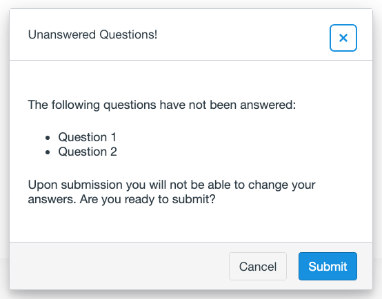
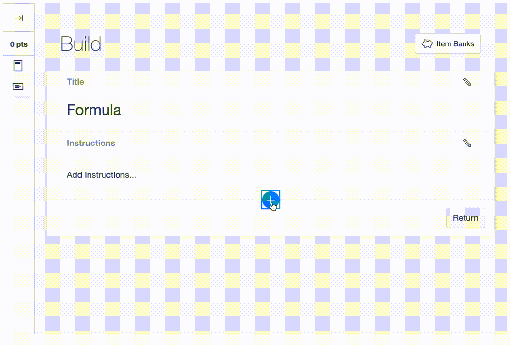
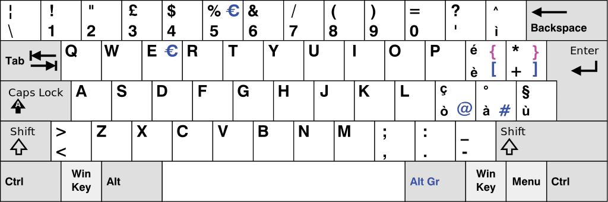

title: 'i18n and l10n: common mistakes'
author:
  name: Omar Khan
  url: http://omarkhan.me/
controls: false
style: style.css

--

# i18n and l10n: common mistakes

--

### Who am I?

- Engineer at [Instructure](http://www.instructure.com/) on Assessments
- Not an expert, take this with a grain of salt, YMMV, etc.

--

### What is this talk about?

- How to recognize the most common i18n fails
- How to fix them when you find them
- Examples from Instructure projects

--

### What is this talk *not* about?

- Specific tools
- Build/configuration stuff
- Technical details like character encodings
- RTL (only because I don't have examples yet)

--

# Let's get started

--

### What's wrong with this design?


--

### What happens if we switch to French?



--

### Possible solutions

- Wrap the text
- Expand the container

--

### Key takeaway

- When you get a mockup, always ask designers what should happen to text that
  doesn't fit in the allocated space
- If in doubt, test in German

--

### Does this JIRA ticket contain any red flags?


--

### First/last names

- In many countries the family name comes first (e.g. China)
- Many countries have very widespread family names
  * ~40% of people in Vietnam are named Nguyen
  * 14 most popular family names in Vietnam account for 90% of the population
  * The top 3 family names in China - Wang (王), Li (李), and Zhang (张) - make
    up over 20% of the population (~277 million people)
- Some countries don't have family names at all (e.g. Myanmar)

--

### Key takeaway

- Store full names in your applications and use those whenever possible
- You can split those names up into "first" and "last" names, but you're now
  writing locale-specific code and should plan accordingly
- Keep common names in mind when indexing your database records

--

# Q. What is "1,000"?

--

### Q. What is "1,000"?

A: It depends

--

### Q. What is "1,000"?

- In the US: one thousand
- In most of continental Europe and Latin America: one

-- image



--

### Thousands grouping

- India and China (~36% of world population) don't traditionally use thousands
  grouping
- US: 100,000,000 = one hundred million
- China: 1,0000,0000 = one yi
- India: 10,00,00,000 = ten crore
- `Intl.NumberFormat` does the right thing for en-IN, but uses thousands
  grouping for zh-CN

--

### Currency and percent symbols

- US: $10, 50%
- France: 10 €, 50 %
- Turkey: ₺10, %50
- `Intl.NumberFormat` handles this for basic number formatting
- Be careful when building input fields like `$[____]` or `[____]%`

--

### Key takeaway

- Numbers are hard
- Always include locale-aware number normalization somewhere in your app
- This is probably more work than you think. Plan for it!

--

### What's wrong with this design?



--

### Dynamically-generated comma-separated lists

"Questions 1, 2, and 3 are unanswered."

--

### Dynamically-generated comma-separated lists

- Makes assumptions that don't hold for many languages:
  * The comma is always a "," character
  * Commas are always followed by a space
  * Commas are used to separate items in a list
  * Items are enumerated from left to right

--

### Key takeaway

- Don't do it
- Use `<ul>` or `<ol>` instead
- If you really need inline styling, use css

-- image



--

### What's wrong with this code?

```js
bank.sharedCount > 0
  ? `${t('Sharing')} (${bank.sharedCount})`
  : t('+ Share')
```

--

### Interpolating translated strings doesn't work

- Makes assumptions that don't hold for many languages:
  * word order
  * separated by a space
  * left to right

--

### Key takeaway

- Don't do it
- Translate the whole string, using placeholders for variables

--

### Translate using placeholders

```js
bank.sharedCount > 0
  ? t('Sharing { count }', { count: bank.sharedCount })
  : t('+ Share')
```

--

### What's wrong with this interaction?



--

### Formula edit interaction

- The teacher includes variables in the question body
- These variables must be wrapped in backticks like `` `x` ``
- Nothing wrong with that, right?

--

### Meet the Italian keyboard



--

### Key takeaway

- Try to avoid interactions that require users to type obscure characters
- Consider keyboard layouts and input methods

--

### Cultural issues

- Education in the US places a heavy emphasis on standardized tests
- These tests consist primarily of multiple choice questions
- The result is a letter or number grade
- This model is far from universal
- I don't remember ever having to answer a multiple choice question in school or
  university
- Oddvar Brekke, our sales lead for Nordic countries, once told me he had a hard
  time getting customers to adopt Quizzes.Next because it doesn't have ungraded
  quizzes ("surveys")

--

### Key takeaway

- If you want to build software that is truly global, you have to design it for
  a global audience
- i18n is more than just translating strings and localizing numbers and dates
- If in doubt, ask in #i18n!

--

# Questions?
