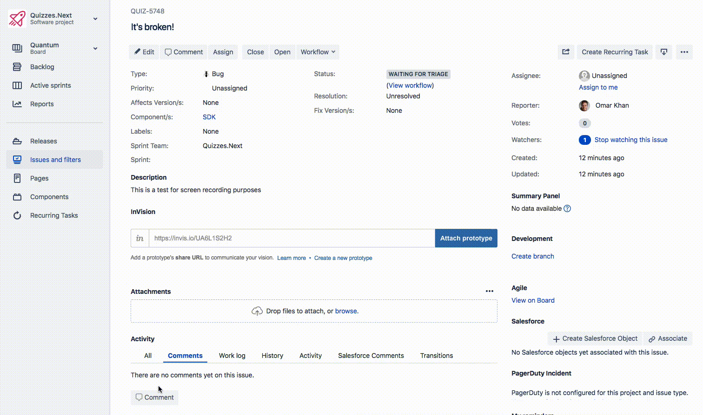
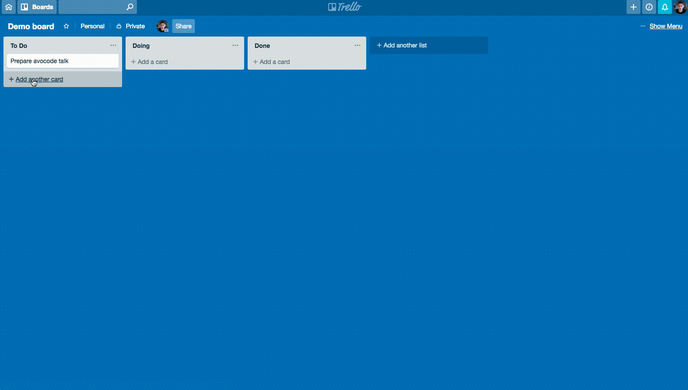

title: Optimistic Updates
author:
  name: Omar Khan
  url: http://omarkhan.me/
controls: false
style: style.css

--

# Optimistic Updates

--

### Who am I?

- Engineer at [Instructure](http://www.instructure.com/) on Assessments
- Not an expert, take this with a grain of salt, YMMV, etc.

--

# Optimistic Updates

## Er, what?

--

# First, some examples.

## What problem are we trying to solve?

-- image

-- image

-- image

--

# Notice anything?

--

### Notice anything?

- Slow!
- OK I throttled the network, but still.

--

### How does that feel?

- Frustrating
- Breaks my train of thought
- Feels disrespectful. My time is valuable!

--

### These examples are of "pessimistic" updates.

Q: Why pessimistic?

--

### These examples are of "pessimistic" updates.

Q: Why pessimistic?

A: Because they don't let the user do anything until the request completes. They
   assume that the request will fail, which is kinda pessimistic.

-- image

--

# What do "optimistic" updates look like?

## More examples.

-- image

-- image

--

# How does that feel?

--

### How does that feel?

- Fast
- Responsive
- Pleasant
- Respectful of the user's time

--

### How does that **feel**?

- I'm throttling the network just like I did in the other examples
- But the UI still feels very snappy
- All about **perceived** performance

--

# Q: Why do we call these "optimistic" updates?

--

Q: Why do we call these "optimistic" updates?

A: Because they assume that the request will succeed, and update the UI immediately as if it had, without waiting for a response.

--

### What happens if the request actually does fail?

- This is where things get tricky
- Notify the user that something went wrong
- Roll back the change?
- Try to fetch the latest state from the backend

-- image

--

### Other concerns

- Race conditions: if requests fire immediately, what if the backend gets a
  request that doesn't make sense yet?
- Possible solution: queue requests

-- image

--

# [Code examples](https://github.com/omarkhan/optimistic-updates-examples)

--

# Don't use this everywhere

- It can make implementation harder. Error handling can be tricky
- Pessimistic updates are still better in some cases
  - When a request actually does fail a lot. In this case pessimism is justified
  - "High-value" interactions, when the user really cares about the outcome and
    is willing to wait a few seconds. Sending a bank transfer, for example

--

# Final words

- This stuff matters
- It's the difference between software people use because they have to (JIRA)
  and becaues they want to (Trello)
- It's an engineering concern! Design gives us beautiful mockups, but they
  don't convey how it **feels**

--

# Questions?
