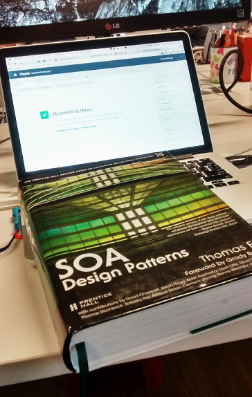

title: Microservices with Rails
author:
  name: Omar Khan
  url: http://omarkhan.me/
controls: false
style: style.css

--

# Microservices with Rails

--

### @\_\_omar\_\_

- Backend lead at [Playlab Games](http://www.playlab.com/)
- Python, ruby, javascript
- Working with ruby and rails at Playlab, with a little nodejs on the side

--

### Scope of this talk

- What are microservices?
- Do you want them?
- How do you do it?
- Microservices at Playlab
- Lessons learned

--

# What are microservices?

--

### Service-Oriented Architecture (SOA)?



--

### What I'm going to talk about:

- Taking a big monolithic web application and splitting it up into little
  pieces, or **microservices**.
- Each microservice runs as a separate process
- Services communicate over the network (http)

--

### Microservices at Playlab

- Currently migrating to microservices on the backend
  - Data persistence
  - User authentication
  - In-app purchase verification
  - Leaderboards
  - Events collector for analytics
- Mostly rails, some nodejs
- Work in progress!

--

# Why would I want to do this?

--

### Why would I want to do this?

- Separation of concerns
- Contain failures
- Scale services independently
- Use the right tool for each job
- Amazon, Netflix

--

### Why would I *not* want to do this?

- Increased ops workload
- These goals can all be achieved in a monolithic codebase, if you have the
  discipline
- Etsy, Facebook

--

### Rule of thumb

```ruby
def is_this_a_good_idea?
  if ops_wizard? or using_heroku?
    'go for it'
  else
    'probably not'
  end
end
```

--

### Where to start

- Identify the main things your application does
- Try to keep services as separate as possible (best if they don't have to talk
  to each other)
- Start with something easy
- Settle on some common identifiers: user ids, etc.

--

### Checklist

- Good test coverage
- Automated deploys
- Monitoring
- Documentation

--

# Examples

--

### Events collector

- Analytics backend
- Nodejs
- Just one endpoint: `POST /events`
- Takes arbitrary json data
- Compresses it, chunks it and stores it on S3

--

### DataCubes

- Data persistence service
- Rails
- Simple api
  - `GET /users/:id/:game`
  - `PUT /users/:id/:game`
- Calls our `passport` service to check user's auth token
- Revision tracking, conflict detection
- Currently uses mysql, we are considering more scalable alternatives

--

### Passport

- Auth/identity service
- Rails
- Two endpoints
  - `POST /:game/login`
  - `GET /:game/verify/:id`
- Stores user data in postgres
- Auth tokens stored in redis

--

### Scrooge

- Payment verification service
- Nodejs
- Synchronous api
  - `POST /amazon`
  - `POST /apple`
  - `POST /google`
- Stores payment data in postgres

--

### TipTop

- Leaderboard service
- Rails
- Allows games to rank anything they like
- Uses redis sorted sets

--

### Still to come

- Facebook activity feeds
- Admin panel
- ...

--

### Lessons learned

- Still early days
- Looking good so far
  - Code is much nicer
  - New features are easier to implement

--

### Code quality

- Great opportunity to refactor/rewrite
- Lint all new code, heavily
  - rubocop
  - reek
  - pronto
- Small codebases are easier to understand and maintain

--

### DevOps

- Automate everything
- Make it easy to roll back changes
- Use heroku or other PaaS if you can
- Containerize
- Monitoring is essential

--

### Backward compatibility

- Version your apis
- Much easier if your services don't need to talk to each other
- If they do, make sure you have integration tests

--

### Dealing with the monolith

- Modify the monolith to call the new microservices
- Modify the new services to call the monolith
- Hack your way through: access the same data stores
- Much easier if you don't have to deal with this at all

--

### Development

Use docker and [fig](https://docs.docker.com/compose/) (AKA docker-compose)

    app:
      build: .
      volumes:
        - '.:/usr/src/app'
      environment:
        RAILS_ENV: development
      links:
        - database
        - redis
      ports:
        - '3000:3000'

    database:
      image: postgres

    redis:
      image: redis

--

### Development

- Have a template for new services
  - https://github.com/pocket-playlab/rails-template
  - Dockerfile
  - docker-compose.yml
    - postgres
    - redis
  - Stripped-down rails base
  - rubocop and reek configuration
  - New Relic configuration
  - Sentry configuration
- Split reusable components into gems

--

### tl;dr

- Build things fast, without worrying about old code
- Use the right tools for each service
- Be prepared to do more ops

--

# Questions?
