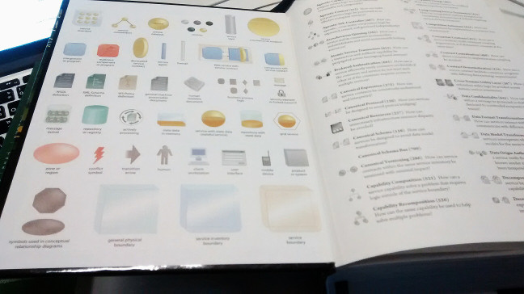

title: Microservices with Rails
author:
  name: Omar Khan
  url: http://omarkhan.me/
controls: false
style: style.css

--

# Microservices with Rails

--

### @\_\_omar\_\_

- Backend lead at [Playlab Games](http://www.playlab.com/)
- Deploying ruby code to millions of users every day

--

### Scope of this talk

- What are microservices?
- Do I want them?
- How do I do it?
- Lessons learned

--

# What are microservices?

--

### What are microservices?

- Nobody really knows
- Many different definitions
- Many different implementations

--

### What are microservices?


--

### What are microservices?



--

### What I'm going to talk about:

Taking a big monolithic web backend and splitting it up into little pieces, or
**microservices**.

--

# Why would I want to do this?

--

### Why would I want to do this?

- Separation of concerns
- Contain failures
- Scale components independently
- Use the right tool for each job

--

### Why would I *not* want to do this?

- Increased ops workload
- These goals can all be achieved in a monolithic codebase, if you have the
  discipline

--

### Rule of thumb

```ruby
def is_this_a_good_idea?
  if ops_expert? or using_heroku?
    'go for it'
  else
    'probably not'
  end
end
```
